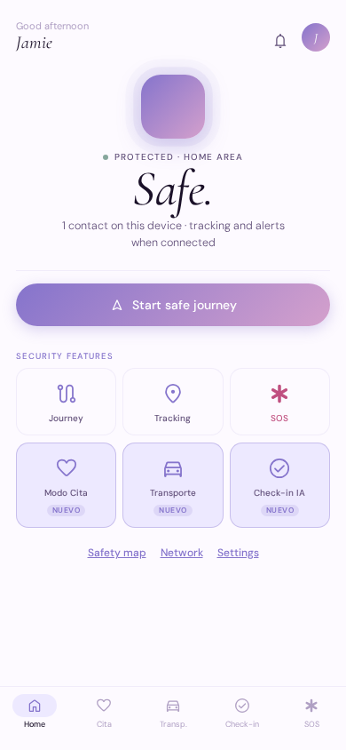
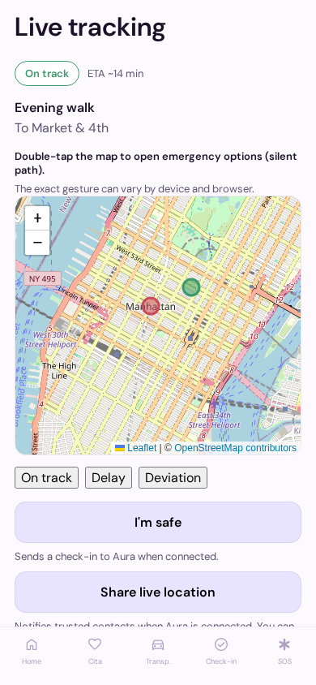
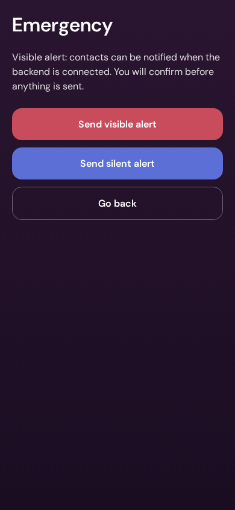

# Aura

**A calm, real-time safety companion for the web** — route-aware check-ins, trusted contacts, and emergency paths designed to stay reachable in one or two taps when stress is high.

> *You are never alone.*

Aura pairs a mobile-first React client with an optional Node API that validates SOS, location share, and “I’m safe” events behind bearer auth, rate limits, and an append-only audit trail. The experience follows the product and UX spec in [`design/`](./design/) (lavender gradient, soft neutrals, non-alarmist copy). **Product entry point:** [`design/AURA_PDR.md`](./design/AURA_PDR.md) (scope, requirements, traceability to detailed specs).

---

## What you can explore today

These flows match the implementation-ready scope from the Aura design package (home through settings):

| Area | What it covers |
|------|----------------|
| **Home** | Safety status hub, journey entry, quick actions, global SOS access |
| **Journey** | Configure a trip, live map tracking, share location, “I’m safe” |
| **Emergency (SOS)** | Visible and silent-style alert paths with calm, accessible messaging |
| **Map & safety intel** | Map layers and safer-route thinking (UI + placeholders as documented) |
| **Trusted network** | Contacts, permissions, grouping |
| **Settings** | Safety defaults, privacy-oriented controls |

Routing reference: [`design/AURA_SCREEN_SPECS.md`](./design/AURA_SCREEN_SPECS.md).

### Public beta (install, env, flows)

**Testers and external integrators:** start with **[`docs/PUBLIC_BETA.md`](./docs/PUBLIC_BETA.md)** — Node version, `web/.env.local` from [`web/.env.example`](./web/.env.example), end-to-end flows (welcome → home → journey → SOS → settings), optional Node API, [`web/docs/BETA_BACKEND.md`](./web/docs/BETA_BACKEND.md) (there is no env var literally named `BETA_BACKEND`), and [`web/docs/OBSERVABILITY.md`](./web/docs/OBSERVABILITY.md). **CEO-approved marketing narrative** for the beta is in [`docs/launch-narrative.md`](./docs/launch-narrative.md) (approval trail: [AURA-64](/AURA/issues/AURA-64)).

---

## Screenshots

Mobile-width captures (390×844 CSS pixels) of the current [`web/`](./web/) client. Files live in [`docs/assets/`](./docs/assets/) as PNG; swap in WebP with the same basename if you prefer smaller binaries—update the paths below accordingly.

**Regenerate** (from `web/` after `npm install`): `npm run capture:readme-screens` — this runs an opt-in Playwright pass (`readme-screenshots.spec.ts`) that writes `screenshot-home.png`, `screenshot-journey.png`, and `screenshot-sos.png`.







Alt text stays concrete and non-alarmist; voice rules: [`design/AURA_LAUNCH_UX.md`](./design/AURA_LAUNCH_UX.md).

---

## Repository layout

| Path | Role |
|------|------|
| [`web/`](./web/) | Vite + React + TypeScript SPA (maps, OAuth hook, app shell) |
| [`server/`](./server/) | Aura API — validated POST routes, audit log, rate limits |
| [`web/docs/`](./web/docs/) | Auth, deploy, security, observability, beta backend notes |
| [`docs/`](./docs/) | Public beta runbook, CEO-approved narrative, beta analytics/outcomes one-pager (see `PUBLIC_BETA.md`, `launch-narrative.md`, `beta-analytics-outcomes-narrative.md`) |
| [`design/`](./design/) | PDR, design system, screen specs, launch UX copy guidance |
| [`.agents/skills/`](./.agents/skills/) | Checked-in agent skills for Cursor / Paperclip (see below) |

---

## Agent skills (AI-assisted development)

Aura keeps **Vercel’s React performance skill** in-repo so agents and editors that load skills from this workspace pick up the same guidance. The lockfile records the source revision for reproducible installs.

| Path | Role |
|------|------|
| [`skills-lock.json`](./skills-lock.json) | Declares installed skills and content hash |
| [`.agents/skills/vercel-react-best-practices/`](./.agents/skills/vercel-react-best-practices/) | Vercel React / Next.js performance rules (use when writing or reviewing `web/`) |

**Install or refresh** (from the repo root, non-interactive):

```bash
npx skills add vercel-labs/agent-skills --skill vercel-react-best-practices -y
```

That updates `.agents/skills/` and `skills-lock.json`. Commit both when the skill version changes. For day-to-day React work in this repo, prefer loading that skill when tasks touch components, data fetching, bundles, or render performance — see [`web/README.md`](./web/README.md).

### Vercel coding agent plugin (Cursor)

[Vercel’s agent plugin](https://vercel.com/docs/agent-resources/vercel-plugin) adds ecosystem context, skills, hooks, and slash commands for Cursor. Install from the **repo root** (Node 18+):

```bash
npx plugins add vercel/vercel-plugin
```

On machines where the Cursor binary is **not** on `PATH` (CI, remote agents, headless workspaces), target Cursor explicitly and use **project** scope so the install is tied to this checkout:

```bash
npx plugins add vercel/vercel-plugin --target cursor --scope project -y
```

Restart Cursor (or the agent session) after install so the plugin loads.

---

## Quick start (local)

### 1. API (optional, for real SOS / journey wiring)

```bash
cd server
npm install
export AURA_API_BEARER_TOKEN="$(openssl rand -hex 24)"
npm run dev
```

Default listen: port **8787**. See [`server/README.md`](./server/README.md) for routes and environment variables.

### 2. Web app

```bash
cd web
npm install
cp .env.example .env.local
# Edit .env.local — set VITE_AURA_API_TOKEN to match AURA_API_BEARER_TOKEN when using the local API
npm run dev
```

With a token set and **without** `VITE_AURA_API_URL`, the Vite dev server proxies `/v1` and `/health` to the local API. Details: [`web/docs/BETA_BACKEND.md`](./web/docs/BETA_BACKEND.md).

### Setup pointers (`web/docs/`)

After the commands above, use the **web package’s** [`web/docs/`](./web/docs/) folder as the canonical place for deeper setup and operations:

| Doc | Use when |
|-----|----------|
| [`web/docs/AUTH.md`](./web/docs/AUTH.md) | Google sign-in and stub auth |
| [`web/docs/BETA_BACKEND.md`](./web/docs/BETA_BACKEND.md) | Client ↔ API wiring, proxies, tokens |
| [`web/docs/DEPLOY.md`](./web/docs/DEPLOY.md) | Staging / production deploy |
| [`web/docs/SECURITY.md`](./web/docs/SECURITY.md) | Threat model and safety notes |
| [`web/docs/OBSERVABILITY.md`](./web/docs/OBSERVABILITY.md) | Logs and telemetry |
| [`web/docs/UX_EMPTY_LOADING_SAFETY.md`](./web/docs/UX_EMPTY_LOADING_SAFETY.md) | Empty states, loading, safety microcopy (UX spec) |

The **server** package documents API env vars and routes in [`server/README.md`](./server/README.md) (pair it with [`web/docs/BETA_BACKEND.md`](./web/docs/BETA_BACKEND.md) when wiring the web app to a real backend — that doc name is what we mean by “beta backend”; it is not a single shell variable).

---

## Documentation index

| Document | Topic |
|----------|--------|
| [`docs/PUBLIC_BETA.md`](./docs/PUBLIC_BETA.md) | Public beta: install, env, flows, optional API, observability pointers |
| [`docs/launch-narrative.md`](./docs/launch-narrative.md) | CEO-approved external narrative one-pager ([AURA-64](/AURA/issues/AURA-64)) |
| [`docs/beta-analytics-outcomes-narrative.md`](./docs/beta-analytics-outcomes-narrative.md) | Beta metrics, reporting, privacy boundaries, outcomes FAQ ([AURA-72](/AURA/issues/AURA-72)) |
| [`web/docs/AUTH.md`](./web/docs/AUTH.md) | Google sign-in and stub mode |
| [`web/docs/BETA_BACKEND.md`](./web/docs/BETA_BACKEND.md) | Client ↔ API wiring, journey ownership, swap path |
| [`web/docs/DEPLOY.md`](./web/docs/DEPLOY.md) | Staging / production deployment notes |
| [`web/docs/SECURITY.md`](./web/docs/SECURITY.md) | Threat model and client/API safety notes |
| [`web/docs/OBSERVABILITY.md`](./web/docs/OBSERVABILITY.md) | Telemetry and structured logs |
| [`server/README.md`](./server/README.md) | API routes, env table, local run |
| [`design/AURA_DESIGN_SYSTEM.md`](./design/AURA_DESIGN_SYSTEM.md) | Tokens, type, components |
| [`design/AURA_SCREEN_SPECS.md`](./design/AURA_SCREEN_SPECS.md) | Routes and shell behavior |
| [`design/AURA_LAUNCH_UX.md`](./design/AURA_LAUNCH_UX.md) | Error and SOS-adjacent copy rules |
| [`web/docs/UX_EMPTY_LOADING_SAFETY.md`](./web/docs/UX_EMPTY_LOADING_SAFETY.md) | Empty / loading / safety microcopy (implementation-ready UX notes) |

---

## Publishing to GitHub (maintainers)

Use this checklist when the remote is **new or empty**, you are wiring **write** access for the first time, or you are onboarding a fork. The canonical public remote for Aura today is **`https://github.com/caco26i/aura-app`**; always double-check with `git remote -v` on your machine.

### Before you push

1. **Repo access** — confirm you can push to the URL shown by `git remote -v` (for the upstream above: HTTPS `https://github.com/caco26i/aura-app.git` or SSH `git@github.com:caco26i/aura-app.git`; forks use their own owner/repo).
2. **Local tree** — on `main`, clean working tree, `npm ci` + `npm run build` under `web/` (and any release checks you use) passing.
3. **Tip alignment** — if your checkout predates recent README/docs-only commits, merge or cherry-pick so this file includes this section before advertising the repo.

### First push (empty remote)

From the repo root, on `main`:

```bash
git remote -v
git push -u origin main
```

If the remote has no `main` yet, that command creates it. If you use SSH, ensure `origin` uses the SSH URL and your key is loaded.

### Credentials (pick one)

| Approach | When to use |
|----------|-------------|
| **HTTPS + PAT** | Quick setup on a laptop; use a fine-scoped token with `contents:write` (and `workflow` if you add Actions later). Prefer a credential helper so the token is not pasted into shell history. |
| **GitHub CLI (`gh`)** | Interactive developer machines: `gh auth login`, then use HTTPS or SSH remotes as configured; useful for quick `gh repo sync` / release flows alongside `git`. |
| **SSH deploy key** | Servers and managed workspaces (e.g. Paperclip); add a **write** deploy key on the GitHub repo settings. |
| **SSH user key** | Day-to-day dev machines already using `git@github.com:...`. |

Managed automation without interactive login must use **non-interactive** auth (deploy key, machine user PAT in a secret store, or provider-specific integration)—not a one-off browser login on the agent host.

### After push

1. Open **github.com** → this repo → default branch `main` → rendered root `README.md`. Confirm code blocks, tables, and **relative links** (including `blob/main`-style paths from the GitHub UI) read correctly.
2. Confirm the tip matches the intended release (README + `web/` + `server/` as intended).
3. **Public README hygiene** — skim root and [`web/README.md`](./web/README.md) in the browser for anything that should stay **internal-only** (VPN URLs, private board links, staging hosts); fix in a follow-up commit if needed.
4. **Process** — if your team tracks releases internally, close out the publish item once the default branch matches what you ship (docs, `web/`, `server/`).

---

## Resumen (ES)

**Aura** es una aplicación web centrada en la seguridad personal: seguimiento de rutas, red de confianza y SOS accesible en pocos toques, con un tono calmado y una interfaz alineada al sistema de diseño del proyecto. El repositorio incluye el cliente en `web/`, la API opcional en `server/` y la documentación operativa en `web/docs/`. Para arrancar en local, sigue la sección *Quick start* arriba.

---

*English is the primary language for v1 repo copy; extend with full Spanish docs when product leadership confirms bilingual priorities.*
